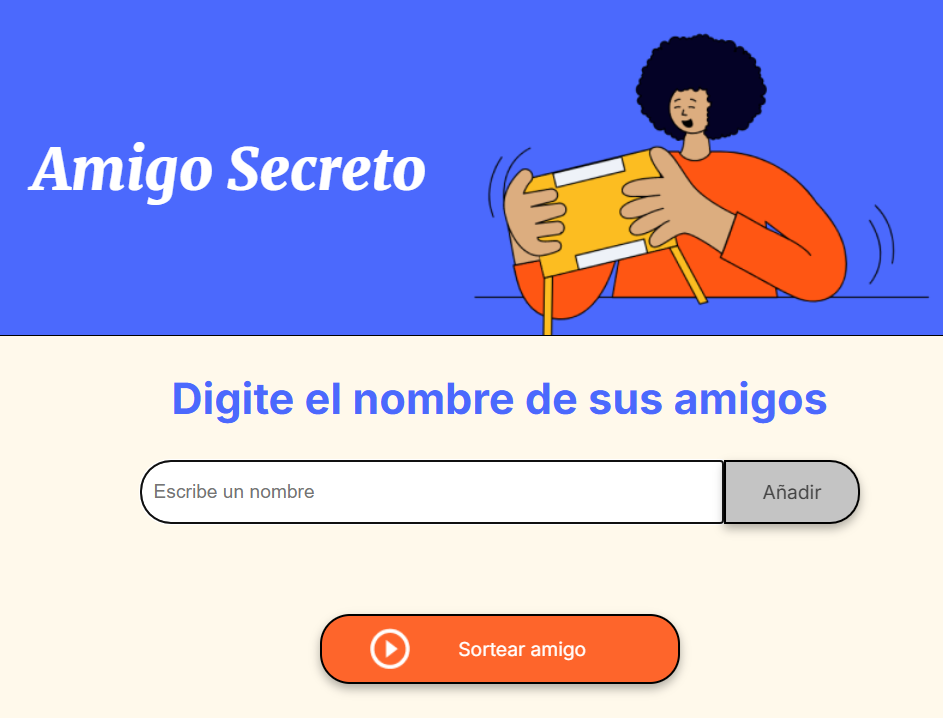

# <h1 align="center"> AMIGO SECRETO </h1>

## Descripción
La aplicación "Amigo Secreto" es ideal para organizar sorteos de amigos secretos de manera fácil y rápida.

Los usuarios pueden agregar participantes a una lista.
Se puede realizar el sorteo de un amigo secreto al azar.
Se actualiza automáticamente la lista de participantes después del sorteo.

## Características
Añadir participantes: Evita duplicados o nombres vacíos.
Validación de entrada: Solo se permiten caracteres alfabéticos.
Sorteo aleatorio: Elige a un participante al azar y lo elimina de la lista.
Interfaz dinámica: Las listas de participantes y resultados se actualizan en tiempo real.

## Instalación
Clona este repositorio:

git clone https://github.com/DnRiv/curso-alura-one.git

Navega al directorio del proyecto:

cd amigo-secreto

Abre el archivo index.html en tu navegador:

open index.html

## Uso
Ingresa el nombre de los participantes en el campo de texto.
Haz clic en el botón "Añadir" para agregar el participante a la lista.
Una vez que haya al menos dos participantes, haz clic en el botón "Sortear" para seleccionar un amigo secreto al azar.
El participante sorteado se mostrará en la sección de resultados, y será eliminado de la lista.

## Errores y Problemas Conocidos

1. No se pueden ingresar dos nombres exactamente iguales
Si intentas agregar un nombre que ya está en la lista, recibirás un mensaje de error. Para solucionar esto, puedes agregar un diferenciador, como un apellido o una inicial. Ejemplo:

     Inválido: "Juan".

     Válido: "Juan P." o "Juan Pérez".

2. Se necesita al menos dos participantes para sortear
Si intentas hacer el sorteo con menos de dos participantes, aparecerá una alerta indicando que se necesitan mínimo dos personas para realizar el sorteo.

3. No se permiten caracteres especiales ni números en los nombres
La aplicación solo acepta letras y espacios. Caracteres especiales como @, #, $, %, 123 no serán permitidos.

4. El amigo sorteado es eliminado de la lista
Cada vez que se realiza un sorteo, el nombre del participante seleccionado es eliminado de la lista de amigos. Si deseas volver a sortear con todos los participantes, deberás agregarlos nuevamente.

5. No hay opción para reiniciar la lista de nombres
Actualmente, la aplicación no cuenta con un botón para reiniciar la lista de nombres rápidamente. Para hacerlo, deberás recargar la página manualmente.

## Posibles Mejoras

Agregar un botón de reinicio: Un botón que permita restablecer la lista de participantes sin necesidad de recargar la página manualmente.

Eliminar participantes individualmente: Agregar un botón o un símbolo junto a cada nombre en la lista para permitir su eliminación en caso de error o duplicación.

